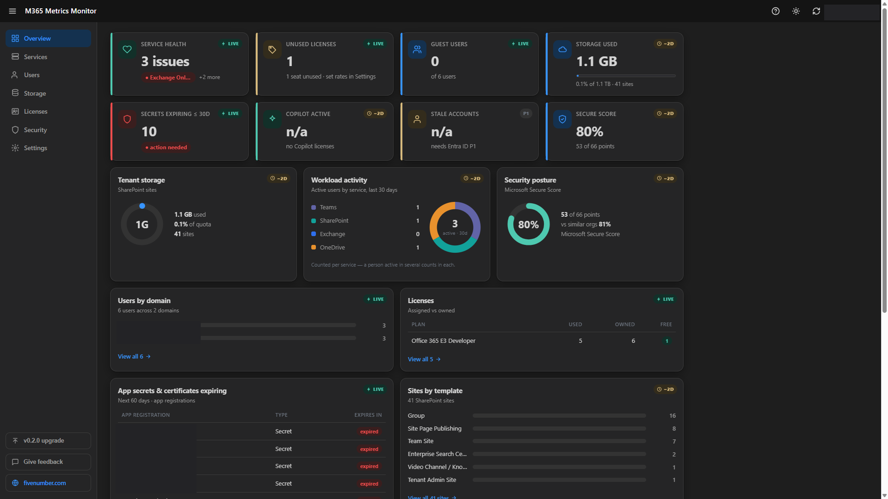
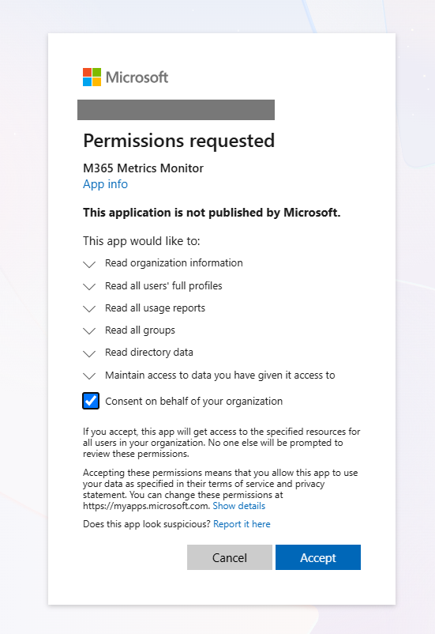
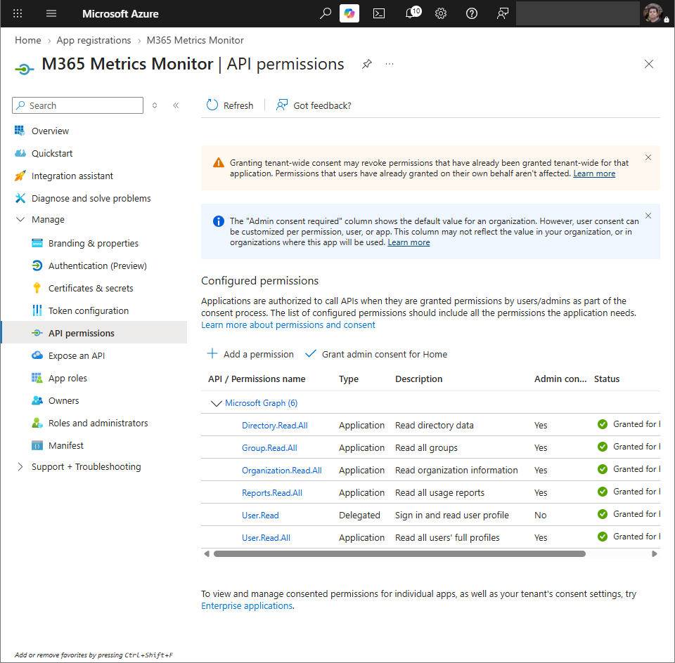
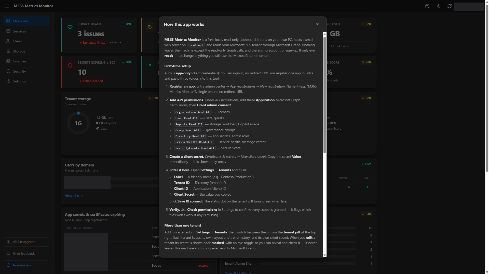
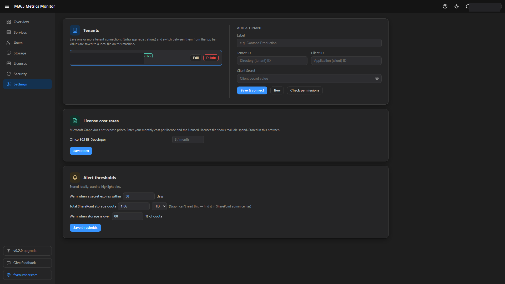
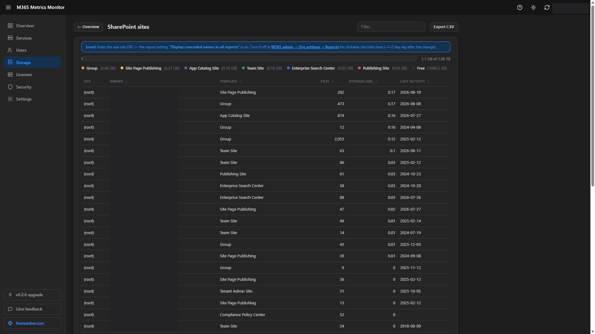

# M365 Metrics Monitor

A free, local, read-only Microsoft 365 dashboard. It runs on your own PC, hosts a
small web server on `localhost`, and opens a dashboard in your browser. One screen
with the numbers you check every morning, pulled from Microsoft Graph. Nothing
leaves the machine except the read-only Graph calls, and there is no account or
sign-up.

It is a **monitor**, not an admin tool. It shows you what needs attention across
service health, licences, storage, secrets, users, security and governance in one
place, so you do not have to click through five different admin portals. To *act* on
anything, you still use the Microsoft admin center.



## What it shows

- **Service health** and the actual named advisories/incidents (by severity)
- **Unused licences** and, with your cost rates in Settings, the monthly idle spend
- **Guest users**, **users by domain**
- **Storage used** with a **quota bar**, **sites by template**, **top sites**
- **App secrets and certificates expiring** across all app registrations
- **Copilot adoption**, **workload activity** (active users by service, as a donut)
- **Secure Score** and security posture
- **Governance**: ownerless groups, empty groups, admin role holders

Tiles are marked **LIVE** (current directory data) or **~2D** (from usage reports,
about one to two days behind). Once the tool has run on more than one day it shows a
**trend arrow** under each number (green means the metric improved, red means it got
worse).

## Run it

### Option A - the packaged app (no .NET needed)

1. Download and unzip the release folder.
2. Run `M365MetricsMonitor.exe`. The dashboard opens at `http://localhost:5137`.
3. On first run it lands on **Settings**. Do the one-time app registration below,
   then add your tenant right in the page (no file editing).

### Option B - from source

```
dotnet run
```

Until a tenant is connected the dashboard shows sample data and the status dot on the
tenant pill is amber. Once connected it turns green and the tiles go live.

## One-time app registration

Auth is **app-only (client credentials)**. No user sign-in, no device code, no
redirect URI. The app runs with its own identity using the Application permissions
you grant.

1. Entra admin center, **App registrations**, **New registration**. Name it
   `M365 Metrics Monitor`, single tenant.
2. **API permissions**, add these **Application** Microsoft Graph permissions, then
   **Grant admin consent**:
   - `Organization.Read.All`  (licences)
   - `User.Read.All`  (users, guests)
   - `Reports.Read.All`  (storage, workload, Copilot usage)
   - `Group.Read.All`  (governance groups)
   - `Directory.Read.All`  (app secrets, admin roles)
   - `ServiceHealth.Read.All`  (service health, message center)
   - `SecurityEvents.Read.All`  (Secure Score)
3. **Certificates & secrets**, **New client secret**. Copy the secret **Value**
   right away (it is shown only once).
4. In the app, open **Settings > Tenants** and enter:
   - **Label** - a friendly name (for example "Contoso Production")
   - **Tenant ID** - Directory (tenant) ID
   - **Client ID** - Application (client) ID
   - **Client Secret** - the value you copied

   Click **Save & connect**. Use **Check permissions** to confirm every scope is
   granted; it flags which tiles will not work if any is missing.

Grant tenant-wide admin consent to the app:



The six Application Graph permissions on the app registration, all granted:



The **Help** icon (top right) has these same steps inside the app for first-time
users.



### Optional (extended)

The **Stale accounts** and **guest inactivity** figures read `signInActivity`, which
needs `AuditLog.Read.All` plus an **Entra ID P1** licence. Without it those two stay
on sample values. Everything else works on the permissions above.

## Multiple tenants

Add more than one tenant in **Settings > Tenants** and switch between them from the
**tenant pill** at the top right. Each tenant keeps its own dashboard layout and its
own trend history. Connections are stored in `tenants.json` next to the app (it holds
the client secrets, so it is git-ignored and never leaves the machine).

## Settings

Open **Settings** to:

- enter a **monthly cost per licence** (Microsoft Graph does not expose prices), so
  the Unused Licences tile shows real idle spend,
- enter your **total SharePoint storage quota** in **GB, TB or PB** (Graph does not
  expose it app-only; find it in the SharePoint admin center) to drive the storage bar
  and its free-space figures,
- set **alert thresholds** used to highlight tiles.

These are stored in your browser. The theme (light/dark) is remembered too.



## Rearranging the dashboard

On the Overview, hover a card and drag its **top-left handle** to rearrange it (works
with mouse and touch). The arrangement is saved for the active tenant. A **Reset
layout** button appears in the top bar once you have changed the order.

## Full lists and export

Click any tile (or a left-nav item) to open the full list behind it - sortable
columns, a filter box, paging and **Export CSV**. On the SharePoint list, if your
tenant hides site URLs (the "Display concealed names in reports" privacy setting) a
note explains it and links straight to the setting; turn it off and real site URLs
become clickable links.



## Updates

The version button at the bottom-left checks GitHub for newer releases and shows a
download link when one exists. The tool never auto-updates.

## Security

Your client secrets live in `tenants.json` (and `appsettings.json` if you seed one
there). Both are **git-ignored** - never commit them. Ship `appsettings.example.json`
(placeholders) instead. A secret is only ever shown back **masked** (with an eye toggle
to reveal it) when you edit that tenant; it stays on this machine and is sent nowhere but
Microsoft Graph. The dashboard binds to `localhost` only and rejects cross-origin
requests. If a secret ever leaks, rotate it in the app registration.

## Build a single-file release

```
dotnet publish -c Release -r win-x64 --self-contained true -p:PublishSingleFile=true
```

Output is in `bin/Release/net8.0/win-x64/publish`. Replace the published
`appsettings.json` with the placeholder version before sharing the folder.
